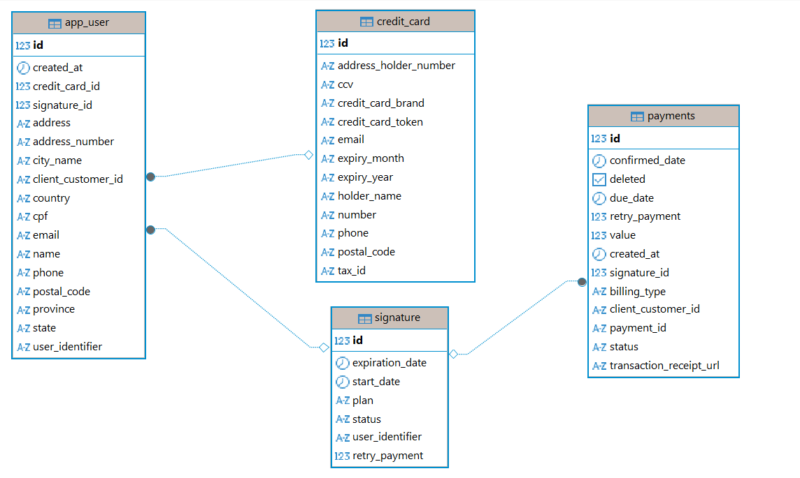
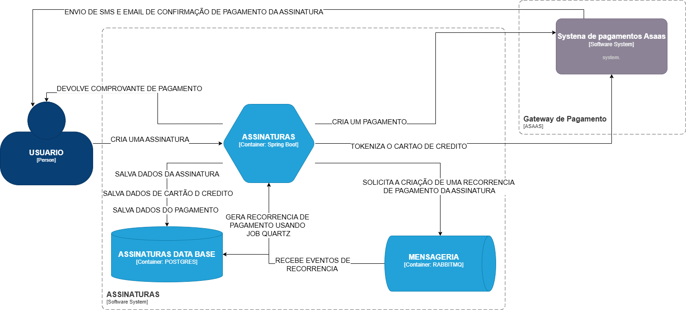
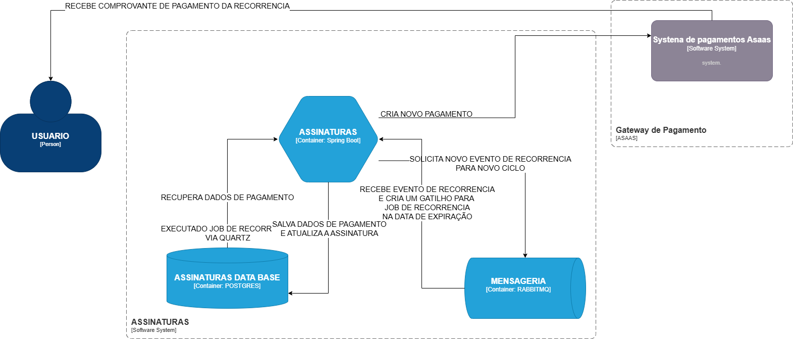

# 📘 Teste Tecnico - Assinaturas Globo


## 📌 Assinaturas — Teste Técnico Globo

Uma API de gerenciamento de assinaturas com:

✔️ Cadastro de usuários
✔️ Criação e controle de assinaturas
✔️ Renovação automática com agendamento Quartz
✔️ Controle de tentativas de cobrança (3 tentativas)
✔️ Cancelamento com uso até expiração
✔️ Jobs agendados para renovação e status de assinatura

- Esta API foi desenvolvida com estrutura real de pagamentos com cartão de crédito usando gateway de pagamento ASAAS.
- Estrutura semelhante a usada em produção
- Utlize um token de Sandbox ASAAS (homologação)
- ⚠️ Caso seja usado um token de produção ASAAS os descontos acontecerão com dinheiro real
- O sistema tem foco em regras de negócio realistas e uso de Quartz Scheduler persistente para automações de datas.

## 📘 Descrição

Essa aplicação implementa um sistema de assinaturas onde:

- É possível cadastrar usuários e criar assinaturas
- As assinaturas se renovam automaticamente na data de vencimento
- Após 3 tentativas de cobrança com falha, a assinatura é suspensa
- Ao cancelar uma assinatura, o usuário continua com acesso até a data de expiração
- Um job Quartz gerencia a renovação e o cancelamento automático

📦 Tecnologias

| Componente       | Versão/Stack            |
|------------------|-------------------------|
| Java             | 21+                     |
| Spring Boot      | Framework principal     |
| Spring Data JPA  | Persistência            |
| PostgreSQL       | Banco de dados          |
| Quartz Scheduler | Agendamento persistente |
| Maven            | Build                   |
| Lombok           | Redução de boilerplate  |
| RabbitMQ         | Mensageria              |
| Open Feign       | Rest Client             |

## Pré-Requisitos

Antes de começar, você precisará ter o Docker instalado em sua máquina.<br>

## Como Rodar

É necessário que você execute o docker compose na raíz do projeto:
`````
docker-compose up -d
`````
Isso irá subir os serviços de Banco de Dados, RabbitMQ e LocalStack para Serviços AWS.<br>

# [Swagger](http://localhost:8080/swagger-ui/index.html)
`````
http://localhost:8080/swagger-ui/index.html
`````
# [Actuator](http://localhost:8080/actuator)
`````
http://localhost:8080/actuator
`````

## Modelo de Dados


## 🔄 Funcionalidades

✅ Cadastro de Usuários

Permite criar usuários via API REST para vincular assinaturas.

-------

🔁 Criação de Assinaturas

Ao criar uma assinatura, é criado um pagamento e tokenizado o cartão de crédito para recorrência, um email e uma mensagem SMS são enviados para os respectivos dados cadastrados informando se houve sucesso no pagamento, o campo transactionReceiptUrl contém a URl do comprovante de pagamento. Um job Quartz é agendado para o dia de vencimento exato para tentativa de renovação.



-------

📅 Renovação Automática

Usa Quartz Scheduler persistente para garantir que os pagamentos ocorrem mesmo após restart da aplicação.
É recuperado os dados de pagamento através do token do cartão de credito, feito pagamento e reagendado nova cobrança.



-------

⚠️ Controle de Tentativas

Se a cobrança falhar:

- O sistema registra a tentativa
- Cada tentativa é agendada pro dia seguinte
- Depois de 3 tentativas sem sucesso, a assinatura é suspensa

-------

❌ Cancelamento de Assinatura

Ao cancelar:

- A assinatura continua ativa até a expiração

- Um job Quartz é agendado para a data final

- No vencimento, o sistema atualiza o status para “cancelled"

-------

🧩 Quartz Scheduler

O projeto utiliza o Quartz com persistência no banco (PostgreSQL), o que garante:

✔ Jobs não perdidos após restart

✔ Recuperação automática de triggers

✔ Políticas de misfire configuradas

✔ Execução exata na data planejada

### Configuração AWS Localstack

- Os valores dos planos BASICO, PREMIUM e FAMILIA estão no Secrets Maneger.

- Troque 'token de sandbox asaas' pelo seu token ASAAS (Homologação), via Secrets Manager.

- Configuração local do Secrets Manager com localstack no arquivo init-aws.sh dentro da pasta compose: 

````shell
awslocal secretsmanager create-secret --name sandbox/asaas/access_token --secret-string '{"token":"token de sandbox asaas", "basico":"19.90", "premium":"39.90", "familia":"59.90"}'

````
### Caso não tenha um token ASAAS use Wiremock

Caso não possua um token ASAAS é possivel testar a API usando o Wiremock configurado.

- Execute o docker compose (O Wiremock é configurado automaticaente)

Use a URL do Wiremock no application.yaml
Descomente a URL:

````yaml
asaas:
  server-url: http://localhost:8089
````


### Configurações do Quartz

#### Criar Tabelas Quartz

Execute o script oficial para PostgreSQL (tables_postgres.sql), disponível na documentação do Quartz

Segue script:

````jql
CREATE TABLE QRTZ_JOB_DETAILS (
  SCHED_NAME VARCHAR(120) NOT NULL,
  JOB_NAME VARCHAR(200) NOT NULL,
  JOB_GROUP VARCHAR(200) NOT NULL,
  DESCRIPTION VARCHAR(250),
  JOB_CLASS_NAME VARCHAR(250) NOT NULL,
  IS_DURABLE BOOLEAN NOT NULL,
  IS_NONCONCURRENT BOOLEAN NOT NULL,
  IS_UPDATE_DATA BOOLEAN NOT NULL,
  REQUESTS_RECOVERY BOOLEAN NOT NULL,
  JOB_DATA BYTEA,
  PRIMARY KEY (SCHED_NAME, JOB_NAME, JOB_GROUP)
);

CREATE TABLE QRTZ_TRIGGERS (
  SCHED_NAME VARCHAR(120) NOT NULL,
  TRIGGER_NAME VARCHAR(200) NOT NULL,
  TRIGGER_GROUP VARCHAR(200) NOT NULL,
  JOB_NAME VARCHAR(200) NOT NULL,
  JOB_GROUP VARCHAR(200) NOT NULL,
  DESCRIPTION VARCHAR(250),
  NEXT_FIRE_TIME BIGINT,
  PREV_FIRE_TIME BIGINT,
  PRIORITY INTEGER,
  TRIGGER_STATE VARCHAR(16) NOT NULL,
  TRIGGER_TYPE VARCHAR(8) NOT NULL,
  START_TIME BIGINT NOT NULL,
  END_TIME BIGINT,
  CALENDAR_NAME VARCHAR(200),
  MISFIRE_INSTR SMALLINT,
  JOB_DATA BYTEA,
  PRIMARY KEY (SCHED_NAME, TRIGGER_NAME, TRIGGER_GROUP)
);

CREATE TABLE QRTZ_SIMPLE_TRIGGERS (
  SCHED_NAME VARCHAR(120) NOT NULL,
  TRIGGER_NAME VARCHAR(200) NOT NULL,
  TRIGGER_GROUP VARCHAR(200) NOT NULL,
  REPEAT_COUNT BIGINT NOT NULL,
  REPEAT_INTERVAL BIGINT NOT NULL,
  TIMES_TRIGGERED BIGINT NOT NULL,
  PRIMARY KEY (SCHED_NAME, TRIGGER_NAME, TRIGGER_GROUP)
);

CREATE TABLE QRTZ_CRON_TRIGGERS (
  SCHED_NAME VARCHAR(120) NOT NULL,
  TRIGGER_NAME VARCHAR(200) NOT NULL,
  TRIGGER_GROUP VARCHAR(200) NOT NULL,
  CRON_EXPRESSION VARCHAR(120) NOT NULL,
  TIME_ZONE_ID VARCHAR(80),
  PRIMARY KEY (SCHED_NAME, TRIGGER_NAME, TRIGGER_GROUP)
);

CREATE TABLE QRTZ_FIRED_TRIGGERS (
  SCHED_NAME VARCHAR(120) NOT NULL,
  ENTRY_ID VARCHAR(95) NOT NULL,
  TRIGGER_NAME VARCHAR(200) NOT NULL,
  TRIGGER_GROUP VARCHAR(200) NOT NULL,
  INSTANCE_NAME VARCHAR(200) NOT NULL,
  FIRED_TIME BIGINT NOT NULL,
  SCHED_TIME BIGINT NOT NULL,
  PRIORITY INTEGER NOT NULL,
  STATE VARCHAR(16) NOT NULL,
  JOB_NAME VARCHAR(200),
  JOB_GROUP VARCHAR(200),
  IS_NONCONCURRENT BOOLEAN,
  REQUESTS_RECOVERY BOOLEAN,
  PRIMARY KEY (SCHED_NAME, ENTRY_ID)
);

CREATE TABLE QRTZ_PAUSED_TRIGGER_GRPS (
  SCHED_NAME VARCHAR(120) NOT NULL,
  TRIGGER_GROUP VARCHAR(200) NOT NULL,
  PRIMARY KEY (SCHED_NAME, TRIGGER_GROUP)
);

CREATE TABLE QRTZ_SCHEDULER_STATE (
  SCHED_NAME VARCHAR(120) NOT NULL,
  INSTANCE_NAME VARCHAR(200) NOT NULL,
  LAST_CHECKIN_TIME BIGINT NOT NULL,
  CHECKIN_INTERVAL BIGINT NOT NULL,
  PRIMARY KEY (SCHED_NAME, INSTANCE_NAME)
);

CREATE TABLE QRTZ_LOCKS (
  SCHED_NAME VARCHAR(120) NOT NULL,
  LOCK_NAME VARCHAR(40) NOT NULL,
  PRIMARY KEY (SCHED_NAME, LOCK_NAME)
);

CREATE TABLE QRTZ_BLOB_TRIGGERS (
  SCHED_NAME VARCHAR(120) NOT NULL,
  TRIGGER_NAME VARCHAR(200) NOT NULL,
  TRIGGER_GROUP VARCHAR(200) NOT NULL,
  BLOB_DATA BYTEA,
  PRIMARY KEY (SCHED_NAME, TRIGGER_NAME, TRIGGER_GROUP),
  FOREIGN KEY (SCHED_NAME, TRIGGER_NAME, TRIGGER_GROUP)
  REFERENCES QRTZ_TRIGGERS(SCHED_NAME, TRIGGER_NAME, TRIGGER_GROUP)
);

CREATE TABLE QRTZ_CALENDARS (
  SCHED_NAME VARCHAR(120) NOT NULL,
  CALENDAR_NAME VARCHAR(200) NOT NULL,
  CALENDAR BYTEA NOT NULL,
  PRIMARY KEY (SCHED_NAME, CALENDAR_NAME)
);

CREATE INDEX IDX_QRTZ_T_NEXT_FIRE_TIME ON QRTZ_TRIGGERS(SCHED_NAME, NEXT_FIRE_TIME);
CREATE INDEX IDX_QRTZ_T_STATE ON QRTZ_TRIGGERS(SCHED_NAME, TRIGGER_STATE);

````

### Executar a Aplicação

```shell
  mvn clean install
  mvn spring-boot:run
```

